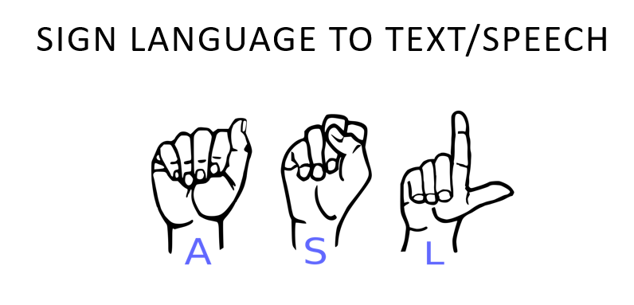
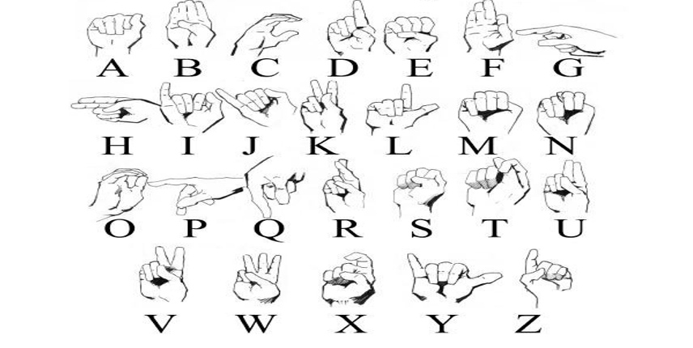
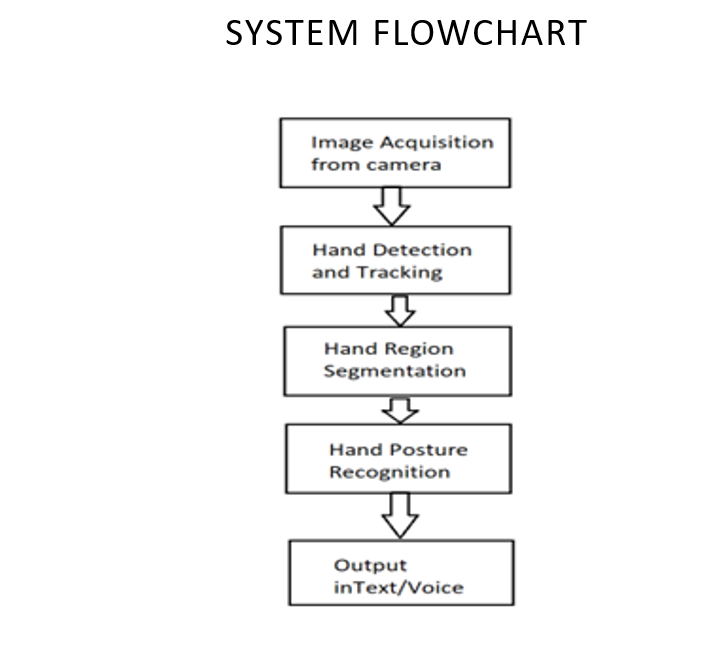
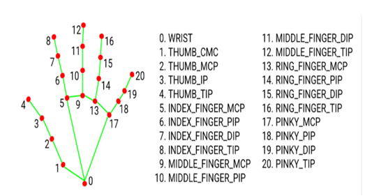
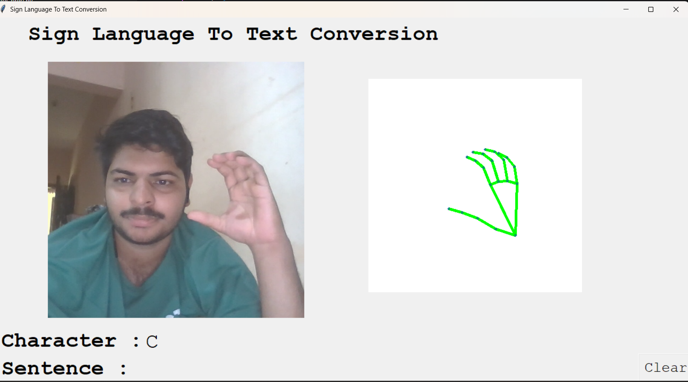
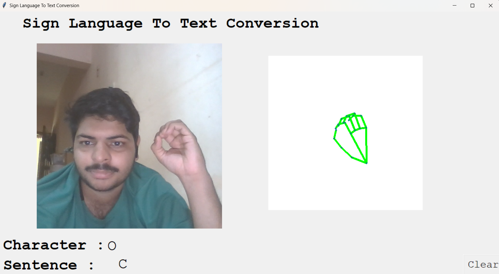

# ✋ GestureSpeak – Real-Time Sign Language to Text Converter



**GestureSpeak** is a real-time sign language recognition system that uses your device's camera to detect hand gestures and convert them into readable English text. It uses computer vision and deep learning to enable seamless communication between sign language users and the digital world.

---

## 🧠 Why GestureSpeak?



Unlike spoken languages that rely on sound, **sign languages** such as American Sign Language (ASL) use hand gestures, facial expressions, and body language to communicate. However, most digital systems do not understand sign language — leading to a communication gap. **GestureSpeak** bridges this gap by converting sign gestures into text in real time.

---

## 🔄 How It Works

The process is divided into a few key stages as shown below:



1. **Capture** hand gestures from a webcam.
2. **Detect & Track** hands using `MediaPipe` and `cvzone`.
3. **Predict** the sign using a deep learning model trained on ASL gestures.
4. **Convert** the result to readable text.
5. (Optional) **Speak** the recognized text using `pyttsx3`.

---

## 🧠 Recognition Model

Our recognition model uses convolutional neural networks (CNNs) trained on sign language datasets. Here's a visual representation of how the model works:



---

## 📸 Project in Action

Below are some screenshots showing the real-time working of the project:





---

## 🚀 Features

- 🖐️ Real-time hand gesture detection using webcam
- 🔠 Converts ASL signs into text instantly
- 🧠 Deep learning-based gesture recognition
- 🔊 Optional text-to-speech output
- 🛠️ Built using Python, OpenCV, MediaPipe, TensorFlow, and more

---

## 🧰 Tech Stack

- **Python 3.7+**
- **OpenCV** – for image and video processing
- **MediaPipe** – for hand detection
- **TensorFlow / Keras** – for deep learning-based recognition
- **cvzone** – simplified wrapper for vision tasks
- **pyttsx3** – text-to-speech conversion
- **pyenchant** – spell checking and correction

---

## 📦 Installation

### Prerequisites

- Python 3.7+
- A webcam

### Steps

1. **Clone the repository**
   ```bash
   git clone https://github.com/yourusername/GestureSpeak.git
   cd GestureSpeak
GestureSpeak/
│
├── final_pred.py               # Main application
├── data_collection_binary.py   # For collecting training data
├── model/                      # Trained model files
├── requirements.txt            # List of dependencies
├── slts.png                    # Project banner image
├── alpahabets in sl.png        # ASL alphabets image
├── system flowchart.png        # Project flowchart
├── recognition model.png       # Model architecture image
├── working1.png                # Demo screenshot 1
├── working2.png                # Demo screenshot 2
└── README.md                   # This file

---

✅ **Next Steps for You:**
- Replace `yourusername` with your actual GitHub username in the clone URL.
- If your images are in a subfolder like `/images/`, update the image paths like `images/slts.png`, etc.
- Update "Your Name" in the **Author** section.

Let me know if you want help generating a `.gitignore`, a LICENSE file, or demo video embed code!
